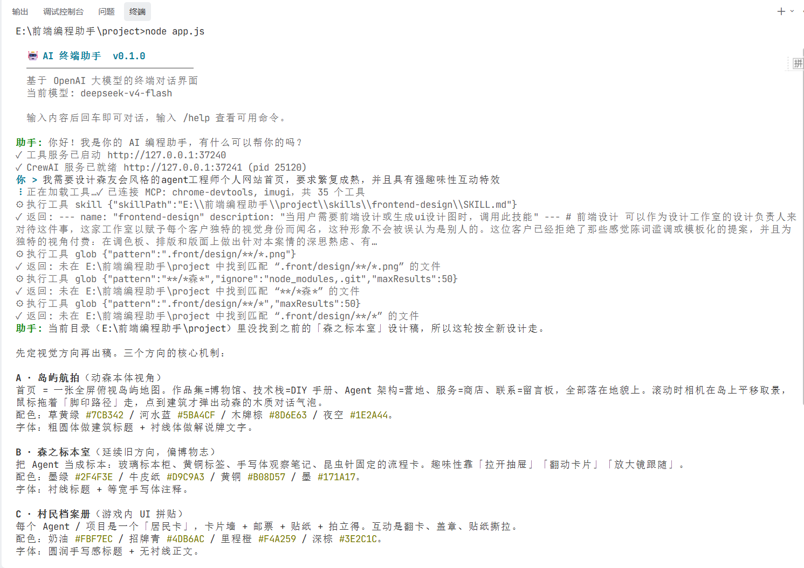
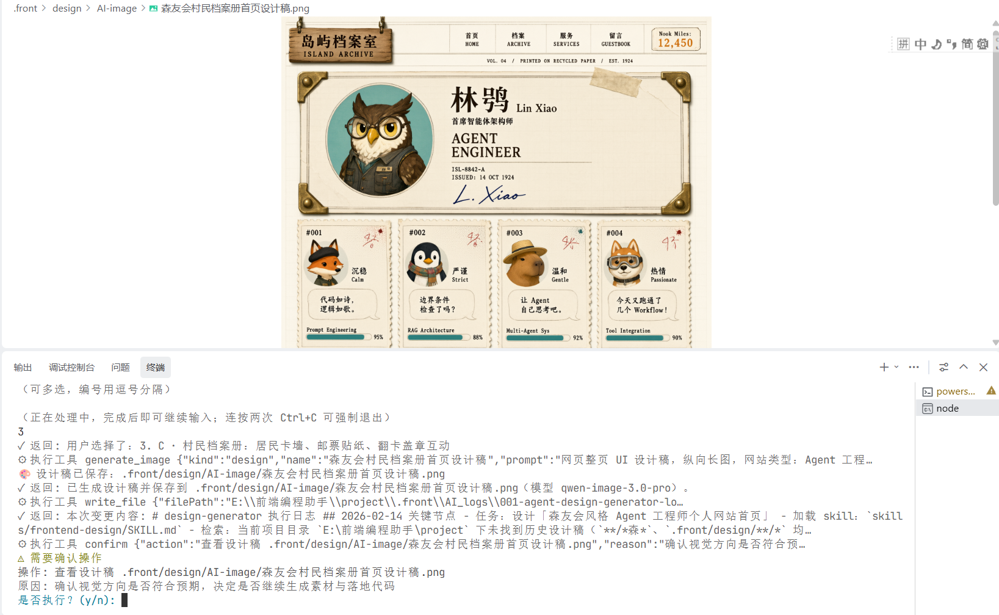
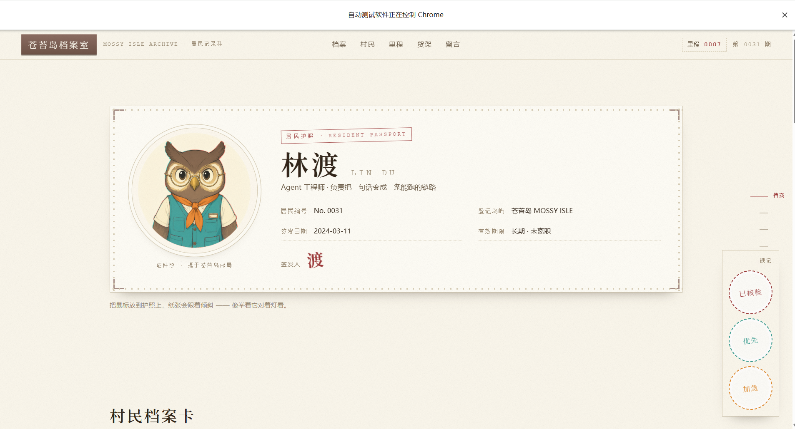

# AI 前端助手（front）

一个跑在终端里的 AI 编程助手（类 Claude Code 形态），提供两种工作模式：

1. **单 Agent 对话**：基于 LangChain.js 的工具代理循环——大模型可调用本地工具与 MCP 工具（读写文件、执行命令、检索代码、操作浏览器等），流式渲染回答到终端。
2. **多 Agent 流水线（CrewAI）**：「UI 设计师 + 前端工程师」双 Agent 团队。用户没给设计图时，设计师出图并经用户确认，工程师按设计说明用 Vue3 还原页面，浏览器截图后与设计图做 SSIM 像素对比，循环调试直到达标；用户给了设计图则直接只跑工程师。

技术底座：Node.js（TUI + 工具系统 + 跨语言进程治理）＋ LangChain.js＋ Python / CrewAI / FastAPI（多 Agent 编排）＋ LanceDB

> 本项目同时是对 LangChain 与 Agent 编排流的一次完整学习实践：上下文工程、工具协议、多进程生命周期、token 预算控制均有实测数据支撑。

## 在线预览

|                  终端对话界面                  |                 设计图生成                 |                调试代码                |
| :--------------------------------------------: | :----------------------------------------: | :------------------------------------: |
|  |  |  |

## 功能清单

**对话与输入**

- 终端流式对话：Markdown 实时彩色渲染、40ms 节流重绘、长文自动降级为追加模式防花屏
- 多模态输入：拖入图片 ； `#` 弹层选择 `.front/design/` 下的设计图 ； `@文件` 引用并把内容带进对话 ；拖入文件自动读取路径
- 自定义指令：`.front/commands/<分组>/<名称>.md` → 输入 `/分组:名称` 触发（全局级 + 项目级，项目优先）

**工具系统（单 Agent 模式）**

- 本地工具 11 个：`read_file` / `write_file` / `edit_file` / `Bash` / `grep` / `glob` / `generate_image` / `confirm` / `select` / `skill` / `memory_save`
- MCP 工具：经 `@langchain/mcp-adapters` 合并 `~/.front` 与项目 `.front` 的全部 MCP 服务（内置搭配 chrome-devtools-mcp 29 个 + imugi 6 个，合计可用约 46 个）
- 安全兜底：工具调用上限 250 轮防死循环；每个工具独立超时（交互型 `confirm`/`select` 放宽至 29 分钟等待人工应答）

**多 Agent 流水线（CrewAI 模式，默认开启）**

- 确定性路由：输入含设计图 → 只跑工程师；否则 设计师 → 工程师（不用 LLM 路由，行为可预测、零 token）
- 设计师：整理画面描述 → 文生图（约 100s）→ `confirm` 确认循环 → 产出原始设计图
- 工程师：视觉模型预转「设计说明」→ Vue3 单文件组件还原 → 素材生成 → 浏览器截图 + 控制台检查 → SSIM 对比（最多 3 轮）→ 全程 6 个人工确认点
- 运行控制：SSE 进度流实时渲染、中途终止（abort）、从指定任务重试（retry）；crew 结束后上下文保留，可接着聊

**知识增强**

- RAG 知识库：`/vector` 将 doc 文档切块向量化入 LanceDB，对话时自动检索注入（15s 超时静默降级，不影响正常对话）
- 两级记忆：`/memory` 结合近期对话自动整理项目级/用户级记忆
- 技能系统：三级目录扫描 `SKILL.md`（项目级 > 内置 > 用户级），按需注入
- 规则集：`@` 引用文件命中 glob 规则时，自动携带对应规范进对话

**关键规则**

- Agent 全程只见文本：设计图由视觉模型转结构化文字说明、对比热力图转逐格像素差异报告，图片 base64 绝不进模型上下文
- 预算约束：单次请求 16000 tokens / 单次 crew 运行 9 分钟（人工确认等待时间不计入）
- 人工确认只走 Node 终端，Python 进程永不读 stdin

## 技术栈

| 层            | 技术                                                                                                            |
| ------------- | --------------------------------------------------------------------------------------------------------------- |
| 终端 UI       | Node.js（ESM）、chalk、marked-terminal、自研 raw-mode 输入与渲染器                                              |
| 对话与工具    | LangChain.js（@langchain/openai、@langchain/core、@langchain/mcp-adapters）、zod、Express（本地工具 HTTP 服务） |
| 多 Agent 编排 | Python 3.11、CrewAI 1.15、FastAPI + uvicorn、SSE 事件流                                                         |
| RAG           | @langchain/textsplitters、OpenAI 兼容 embedding、LanceDB                                                        |
| 模型          | 任意 OpenAI 兼容接口，默认配阿里云 DashScope（qwen 文本模型 + qwen-image 文生图）                               |
| 测试          | Vitest + 自研无头 TUI 回归（Node 侧）；自研断言脚本 66 + 21 项（Python 侧）                                     |

## 项目亮点

**解决了什么问题**

- Python 拿不到用户终端：Node 保留终端所有权，Express 工具服务 + HTTP 回调，让 `confirm`/`select`/`generate_image` 零改动复用
- Agent 看不到设计图：开工前由视觉模型转成结构化文字说明（实测 1954 字符 ≈ 1221 tokens），作为还原的唯一依据
- 对比结果灌水 ：`imugi_compare` 原生返回 base64 热力图，单次 4115 tokens 且模型读不了；改为自算逐格像素差异文本报告后仅 161 tokens，3 轮对比从 ~12000 降到 ~500
- CrewAI 无可用中途打断，实行【立即标记 + 工具边界收手】两段式终止
- 跨语言进程治理：Node 拉起 / 探活 / 终止 uvicorn 子进程，端口竞态、孤儿进程、Windows 编码问题全部显式处理
- retry 与旧 worker 并跑会串工作目录 → retry 前强制等待旧线程退出（20s 超时），绝不并行

**工程化**

- 配置两级合并（项目优先）；API Key 单一来源，Python 读同一份 setting.json
- 测试：Node 侧 smoke / 输入流回归 / 无头浮层回归 / vitest 单测；Python 侧 66 项闭环测试 + 21 项真 uvicorn 端到端测试
- 实现agent工作流的可观测性：让agent在工作过程中，生成关键节点原始记录与本轮总结文档，用于回放调试

**优化 / 设计**

- 角色上下文与工具双隔离：不同AI角色裁剪不同的提示词文档、可用工具白名单
- 自动统一DashScope图片接口的URL地址，解决切换兼容模式后文生图404报错；增加识别判断，不会错误修改自建代理地址。
- 四套上下文注入体系：RAG / 记忆 / 技能 / 规则，互不干扰、各自可降级
- 终端 TUI：raw-mode 逐键输入、Markdown 渲染、spinner、文件/图片浮层，以及优雅退出链路（SIGINT 双击强退、MCP 与 Python 子进程清理、会话落盘）

## 项目结构

```
├── app.js                    # 入口
├── config.js                 # 配置装配（setting.json 两级合并 + imageBaseURL 归一化）
├── src/
│   ├── server/
│   │   ├── toolServer.js     # 本地工具 HTTP 服务（供 Python 回调执行工具）
│   │   ├── crewService.js    # Python/uvicorn 子进程生命周期
│   │   └── start.js          # 独立起工具服务
│   ├── tools/                # 本地工具
│   ├── utils/
│   │   ├── chat/             # chatService 对话主链路、context 上下文装配、rules 规则
│   │   ├── storage/          # LanceDB 向量库、embedding、记忆
│   │   ├── image/            # 文生图、设计图转文字说明、像素差异报告
│   │   ├── fs/  input/  tui/ # 文件内容路径读取
│   │   └── docs/             # 提示词模板
│   └── tui/                  # 渲染器、输入控制器、浮层
├── python-fastapi/           # CrewAI 编排服务
│   ├── main.py               # FastAPI 端点
│   ├── runner.py             # worker 线程、终止/重试、事件日志（seq 游标 + sealed 封口）
│   ├── crew_builder.py       # 读取agent、tasks配置
│   ├── node_tools.py         # 从 Node /tools 动态生成 CrewAI Tool
│   ├── llm_factory.py  bootstrap.py
│   ├── config/agent.yaml  config/tasks.yaml   # Agent / Task 定义
│   ├── test_loop.py          # Node↔Python 闭环测试
│   ├── test_api.py           # 真 uvicorn + 真 SSE 端到端测试
│   └── requirements.txt
├── skills/frontend-design/   # 内置设计技能
├── test/                     # 测试文件
└── image/README/             # 预览截图
```

## 运行步骤

**前置要求**：Node.js ≥ 18（建议 22）；Python ≥ 3.11；支持 Windows / macOS / Linux（默认存储路径为 Windows 风格，非 Windows 环境见 FAQ 第 6 条）

```bash
# 1. 安装 Node 依赖
npm install

# 2. 创建 Python 虚拟环境并安装依赖
cd python-fastapi
python -m venv .venv
# Windows:
.venv\Scripts\pip install -r requirements.txt
# macOS / Linux:
.venv/bin/pip install -r requirements.txt
cd ..

# 3. 配置 API Key（必需）
#    全局：~/.front/setting.json
#    或 项目级：<项目目录>/.front/setting.json（优先生效）
```

```json
{
  "apiKey": "sk-...",
  "baseURL": "https://dashscope.aliyuncs.com/compatible-mode/v1",
  "model": "qwen3.8-flash"
}
```

```bash
# 4. 启动
npm start          # 或 npm link 后在任意项目目录敲 front
```

**注意：**

1. 启动程序后，CrewAI 编排服务由 Node 自动拉起（首次冷启动 import 约 49s，属正常现象）；起不来只告警降级，不影响普通对话。
2. “CrewAI 编排服务启动完成”的消息提示出现后，agent工作流才能正常运行，但不影响普通对话功能。

**可选配置**（同为 setting.json 字段）：

| 字段                                                            | 用途                                                         |
| --------------------------------------------------------------- | ------------------------------------------------------------ |
| `imageModel` / `imageApiKey` / `imageBaseURL`             | 文生图（缺省沿用 apiKey/baseURL，DashScope 地址自动归一化）  |
| `embeddingModel` / `embeddingApiKey` / `embeddingBaseURL` | `/vector` RAG 必填三件套                                   |
| `mcpServers`                                                  | MCP 服务（如 chrome-devtools-mcp、imugi）                    |
| `crewEnabled`                                                 | 设为`false` 关闭 CrewAI 编排                               |
| `pythonExe` / `crewDir`                                     | venv 解释器与服务目录（相对路径相对程序安装目录解析）        |
| `vectorStorePath`                                             | 向量库落盘目录（默认`D:/frontCode/vector_store/<项目名>`） |

**测试**

下面这些测试脚本，仅项目开发者**本地源码仓库**使用；npm安装后的**发布包不包含**测试目录，无法执行。

```bash
npm run smoke         # 工具/服务冒烟
npm run test:input    # 输入控制器回归
npm run test:overlay  # `#` 浮层无头回归
npm run test:unit     # vitest 单测

# Python 侧（先起工具服务再跑）
node src/server/start.js 8799
python-fastapi/.venv/Scripts/python python-fastapi/test_loop.py   # 66 项闭环
python-fastapi/.venv/Scripts/python python-fastapi/test_api.py    # 21 项端到端
```

**运行失败常见点**：见下节 FAQ。

## 接口文档

### CLI 命令

| 命令                                   | 说明                                               |
| -------------------------------------- | -------------------------------------------------- |
| `/help`、`/?`                      | 显示帮助                                           |
| `/clear`                             | 清空对话历史（保留 system 提示词）                 |
| `/asset <描述>`                      | 手动生成素材图，存到`.front/design/AI-asset/`    |
| `/vector [文件路径]`                 | 文档向量化入库（缺省索引 doc 目录全部文档）        |
| `/memory`                            | 结合上下文与近期对话生成两级记忆                   |
| `/exit`、`/quit`、`/bye`、Ctrl+C | 退出（先优雅清理；连按两次 Ctrl+C 强退）           |
| `/<分组>:<名称>`                     | 自定义指令（`.front/commands/<分组>/<名称>.md`） |

### Python 编排服务（127.0.0.1，端口由 Node 动态分配）

| 方法 | 路径                            | 说明                                                                                                      |
| ---- | ------------------------------- | --------------------------------------------------------------------------------------------------------- |
| GET  | `/health`                     | 探活：`{ok: true, nodeToolUrl}`                                                                         |
| GET  | `/tools?role=engineer`        | 透传 Node 工具清单，按角色裁剪                                                                            |
| GET  | `/llm`                        | 校验 LLM 可构造（只回 model/provider/baseUrl，不回密钥）                                                  |
| POST | `/run`                        | 启动一次 crew。body:`{mode: "team"\|"engineer", userInput, designImage?, cwd?}` → `{ok, runId, mode}` |
| GET  | `/run/{id}/events?from=<seq>` | SSE 进度流（断线带`from` 续传），以 `end` 事件收尾                                                    |
| POST | `/run/{id}/abort`             | 终止：立刻拿回控制权，当前 LLM 调用跑完后在工具边界收手（约 3~10s）                                       |
| POST | `/run/{id}/retry`             | 从指定任务重跑。body:`{fromTask?}`，缺省最后阶段；粒度为任务级                                          |

### Node 工具服务（127.0.0.1 随机端口，仅本机，供 Python 回调）

| 方法 | 路径                      | 说明                                                                                          |
| ---- | ------------------------- | --------------------------------------------------------------------------------------------- |
| GET  | `/health`               | `{ok, roles: ["designer", "engineer"]}`                                                     |
| GET  | `/tools?for=engineer`   | 工具清单：`{name, description, parameters, interactive, timeout}`                           |
| GET  | `/context?for=engineer` | 按角色裁剪后的完整上下文（系统文档 + 用户上下文 + 技能清单）                                  |
| POST | `/tool/invoke`          | 执行工具。body:`{name, args, cwd?}` → `{ok, text, data}`（text 给模型，data 给编排逻辑） |
| POST | `/design/describe`      | 视觉模型读设计图 → 结构化文字说明（布局/配色含 hex/元素清单）                                |

## 常见问题解答（FAQ）

1. **启动后只回复「演示模式」**：未检测到 apiKey。在 setting.json 配置 `apiKey` 后重启。
2. **文生图报「返回了非 JSON 内容」/ 404**：`imageBaseURL` 填了对话用的兼容模式地址（`.../compatible-mode/v1`）。程序会自动把 DashScope 域名归一化为 `/api/v1`；自建反向代理的自定义前缀不会自动改写，需手工填对原生接口根路径。
3. **Windows 下中文日志崩溃**：程序已强制 UTF-8（`PYTHONIOENCODING` / `PYTHONUTF8`）。自行调试时不要用 `curl | python` 管道——GBK 终端会破坏中文 JSON，用 httpx 直接请求。
4. **CrewAI 服务要等很久才就绪**：冷启动 `import crewai/uvicorn` 约 49s（就绪上限 90s），属正常；每次都超 90s 才是异常，日志会回吐尾部 50 行帮助定位。
5. **MCP 连接失败**：只告警跳过，不影响聊天。检查 setting.json 的 `mcpServers`；MCP 子进程 30s 内未完成握手会被放弃。
6. **向量库 / 对话记录写入失败**：默认落盘 `D:/frontCode/`（LanceDB 的原子提交不支持 FAT32 等非 NTFS 盘）。其他盘符请通过 `vectorStorePath` 指定 NTFS/APFS/ext4 目录。
7. **强杀 Node 后残留 python 进程**：Windows 无 Job Object 父子绑定，SIGKILL / 任务管理器强杀无法触发清理钩子；正常退出（Ctrl+C、`/exit`）不会残留。
8. **crew 跑一半 Ctrl+C 会怎样**：Node 立即拿回控制权，当前 LLM 调用跑完后 crew 在工具边界收手（3~10s），随后 Python 子进程被终止、退出无残留。
9. **`/vector` 报缺 embedding 配置**：RAG 需要单独的 `embeddingModel` / `embeddingApiKey` / `embeddingBaseURL` 三件套，与对话模型配置相互独立。

## 未来计划

1. 重构服务通信方式：将CrewAI独立部署为HTTP API服务，Node终端通过网络请求调用，移除本地拉起Python子进程的实现，消除本地Python环境依赖。
2. 完善Agent工具调用异常处理：在try-catch基础上增加错误分类、报错信息精简、重试次数限制与运行日志记录。
3. 增加Agent任务量化指标：统计工具调用成功率、失败原因分类，方便评估Agent执行效果。
4. 异常场景自动化测试：模拟工具选择错误、任务卡死、模型乱返回等线上异常，持续优化Agent工作流。
5. 迭代升级：持续学习Agent相关新技术，不断扩展项目能力。
